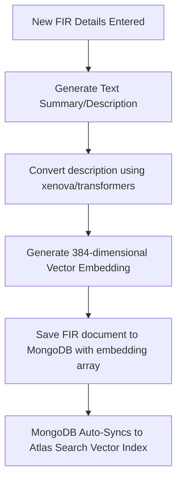
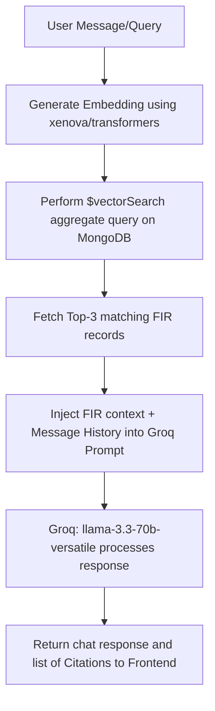

# DRISHTI AI Platform - Backend Architecture & Documentation (`brain.md`)

Welcome to the backend documentation for the **DRISHTI AI Platform**, an intelligence and analytics platform designed to assist police departments in mapping criminal networks, analyzing First Information Reports (FIRs), predicting hotspots, and processing forensic documents.

---

## 🚀 Tech Stack

The backend is built as a modular Express service in TypeScript, deploying seamlessly to Zoho Catalyst AppSail (or any Node.js environment).

*   **Runtime & language:** Node.js (v18+) with TypeScript and native ES Modules (`"type": "module"`).
*   **Web Framework:** [Express.js](https://expressjs.com/)
*   **Database:** [MongoDB](https://www.mongodb.com/) via [Mongoose](https://mongoosejs.com/) for Object Data Modeling (ODM).
*   **Vector Search:** MongoDB Vector Search (utilizing a `$vectorSearch` aggregation stage with the index name `autoembed_index` mapped to the `embedding` path).
*   **AI SDK & LLM:** [Groq SDK](https://github.com/groq/groq-sdk) powered by the `llama-3.3-70b-versatile` model.
*   **Embeddings Generator:** `@xenova/transformers` (running local execution of the `Xenova/all-MiniLM-L6-v2` lightweight Hugging Face model for 384-dimensional dense vectors).

---

## 🗄️ Database Schemas

### 1. FIR Schema (`server/src/models/Fir.ts`)

Represents a single First Information Report (FIR). This model serves as the core source of truth for RAG (Retrieval-Augmented Generation), entity analysis, network graph builds, and semantic searches.

```typescript
const FIRSchema = new mongoose.Schema({
    fir_number: { type: String, required: true, unique: true },
    ps_name: { type: String, required: true },        // Police Station Name
    district: { type: String, required: true },
    state: { type: String, default: 'Karnataka' },
    incident_date: { type: Date, required: true },
    registered_date: { type: Date, required: true },
    crime_type: { type: String, required: true },
    ipc_sections: [{ type: String }],                 // e.g. ['302', '307']
    status: {
        type: String,
        enum: ['Under Investigation', 'Chargesheeted', 'Convicted', 'Absconding', 'Closed'],
        default: 'Under Investigation'
    },
    description: { type: String, required: true },    // Raw text used to generate the embedding
    accused: [
        {
            name: { type: String },
            alias: { type: String },
            age: { type: Number },
            gender: { type: String, enum: ['Male', 'Female', 'Other'] },
            address: { type: String },
            aadhar_last4: { type: String }
        }
    ],
    victim: [
        {
            name: { type: String },
            age: { type: Number },
            gender: { type: String }
        }
    ],
    officer_incharge: { type: String },
    embedding: { type: [Number], default: [] },        // 384-dimensional vector
    created_at: { type: Date, default: Date.now }
})
```

---

## 🔌 API Endpoints & Routing

The router is mounted on `/api`.

### Core Health
*   **`GET /api/health`**: Simple health check route.

### AI Engine (`/api/ai/...`)

All AI sub-routes are bundled inside [ai.ts](file:///d:/PC%20Data/MERN/.Projects/The_Black_Swans/server/src/routes/ai.ts) and mounted under `/api/ai`.

| Route | Method | Description | Input Schema | Output Keys |
| :--- | :--- | :--- | :--- | :--- |
| `/chat` | `POST` | RAG Chatbot querying historical cases | `{ message: string, history: Array }` | `{ response: string, citations: Array }` |
| `/ocr` | `POST` | Processes extracted raw text and maps to structured schema using Groq | `{ text: string, confidence: number }` | `{ status, language, confidence, extractedFields, rawText }` |
| `/ner` | `POST` | Named Entity Recognition (PERSON, LOCATION, VEHICLE, PHONE, DATE) | `{ text: string }` | `{ entities: Array<{ text, category, start, end }> }` |
| `/forecast`| `GET` | Generates hot locations and risk probabilities | *None* | `{ district, forecastWindowDays, predictions }` |
| `/anomaly` | `GET` | Flags sudden spikes (e.g. 350% deviation in Vehicle Theft) | *None* | `{ alerts: Array }` |
| `/document`| `POST` | Financial Forensic & ID Verification Analyzer | `{ text: string }` | `{ documentType, extractedFields, flaggedTransactions, riskPatternFlag }` |
| `/similarity`| `POST`| Modus Operandi (MO) similarity extraction against historic cases | `{ firDetails: string }` | `{ matches: Array<{ firId, station, date, similarityScore, commonFactors }> }` |
| `/graph` | `GET` | Dynamic Syndicate / Network Graph mapping people, phones, and vehicles | `?q=searchQuery` (Optional filter) | `{ nodes: Array, links: Array }` |
| `/export-pdf`| `POST`| Triggers the generation of PDF summaries | *None* | `{ status, downloadUrl, generatedAt }` |

---

## 🔄 AI Data Flows

### 1. FIR Ingestion & Vectorization Flow
This flow is run when new FIRs are registered, or during bulk seeding via [seed_graph_data.ts](file:///d:/PC%20Data/MERN/.Projects/The_Black_Swans/server/seed_graph_data.ts).



---

### 2. Retrieval-Augmented Generation (RAG) Chat Flow
Executed when a user posts to `/api/ai/chat`.



---

### 3. Modus Operandi (MO) & Case Similarity Flow
Executed when matching a new case or checking crime patterns.

```mermaid
graph TD
    A[New FIR Raw Details] --> B[Generate Vector Embedding]
    B --> C[Retrieve Top Matches from MongoDB Vector Search]
    C --> D[For each match: Format prompt detailing (New Case vs Historical Case)]
    D --> E[Groq Llama-3.3 extracts 2-4 exact common factors/patterns]
    E --> F[Filter out self-matches and return matching score & common factors]
```

---

### 4. Criminal Syndicate Network Graph Flow
Builds connections between different entities across all files in the database.

```mermaid
graph TD
    A[Request /api/ai/graph] --> B{Query String Present?}
    B -- Yes --> C[Search for exact name, phone, or plate in MongoDB]
    B -- No --> D[Fetch 10 most recent FIRs]
    C --> E[Assemble Context containing Description, Accused Names, Victims]
    D --> E
    E --> F[Send context to Groq to map network links]
    F --> G[Extract JSON containing Node entities (PERSON, PHONE, VEHICLE)]
    G --> H[Extract JSON containing Links (CO_ACCUSED, SHARED_PHONE, USED_VEHICLE)]
    H --> I[Filter out unrelated elements and return Graph Object]
```

---

## 🛠️ Setup & Execution

### 1. Environment Variables (`.env`)
Ensure the following are defined in your `.env` file inside the `server/` directory:
```bash
PORT=5000
MONGO_URI=mongodb+srv://<username>:<password>@<cluster>.mongodb.net/drishti
GROQ_API_KEY=gsk_...
```

### 2. Standard Commands
*   **Install Dependencies:**
    ```bash
    npm install
    ```
*   **Run Development Server (with hot reloading):**
    ```bash
    npm run dev
    ```
*   **Build TypeScript:**
    ```bash
    npm run build
    ```
*   **Run Production Build:**
    ```bash
    npm start
    ```

### 3. Seeding Database with Syndicate Sample Data
Run the seeding script to populate MongoDB with interconnected cases (useful for graphing, similarity checks, and chatbot retrieval):
```bash
npx tsx seed_graph_data.ts
```
*(This script will generate local embeddings using Xenova/all-MiniLM-L6-v2 and write documents to your Atlas database).*
